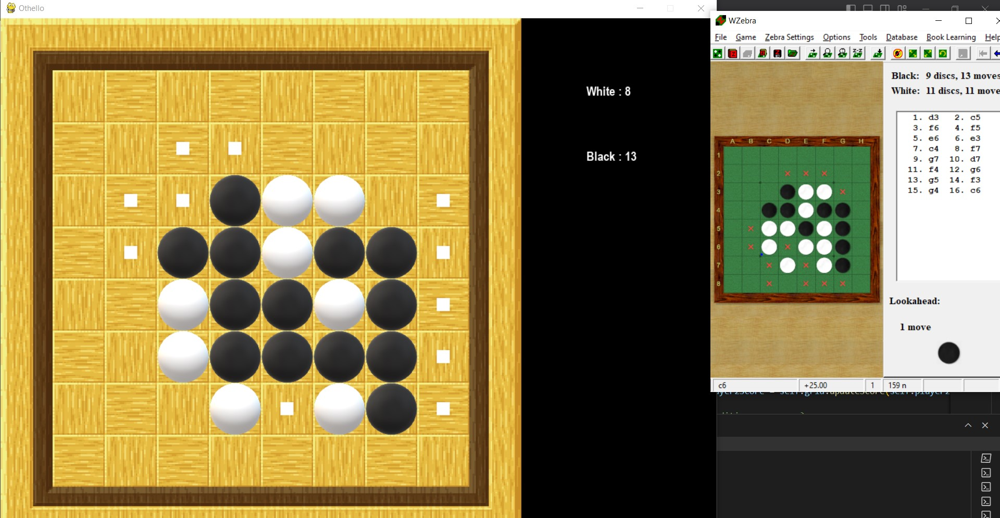
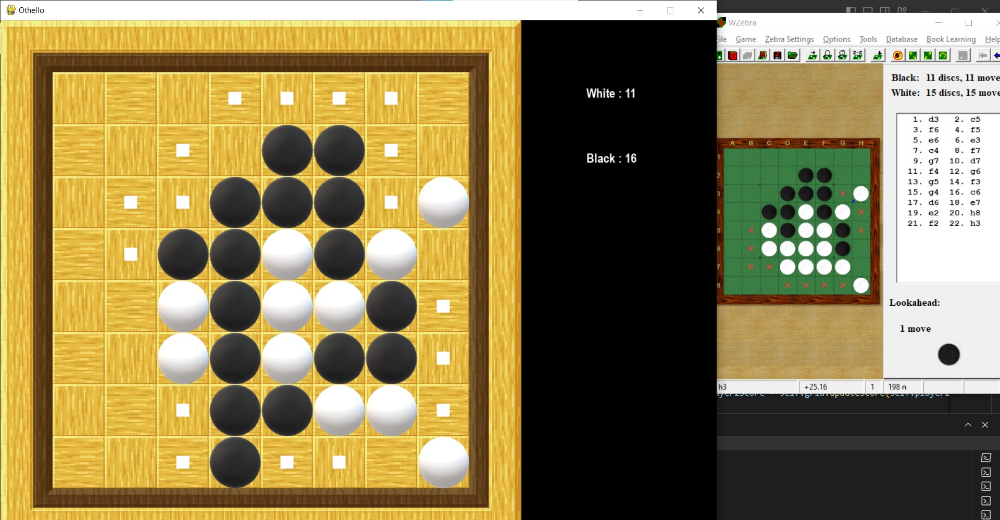
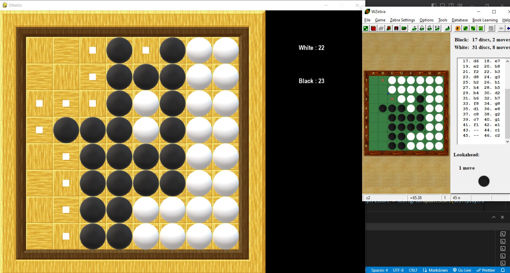

# Phần này sẽ để báo cáo kết quả thử nghiệm của các từng thuật toán
## Format 
- Nêu hàm heuristic sử dụng 
- Kết quả thu được, nêu rõ tham số sử dụng (depth, hàm/engine đem ra so sánh, số ván chơi)
- Giải thích kết quả + show code/hình ảnh minh họa  

**1. Minimax Algorithm**
- Heuristic 1: Coin Party: Khá phế; ở nước tầm 55,56 nó có mobility thấp nên phải pass qua 2 lần. Dù ban đầu có lợi thế tạm thời nhưng lại để đối thủ chiếm corner và các ô quan trọng => mất hết 4 corner => thua 18-46

- Heuristic 2: Local Maximization (basically add weight for each cell)

- Heuristic 3: coinParty + mobility: khá lạ khi có 1 lần bị pass liên tiếp 2 lượt (???) và đi một số nước khá loudy

Kết quả cuối cùng như cc :) 

