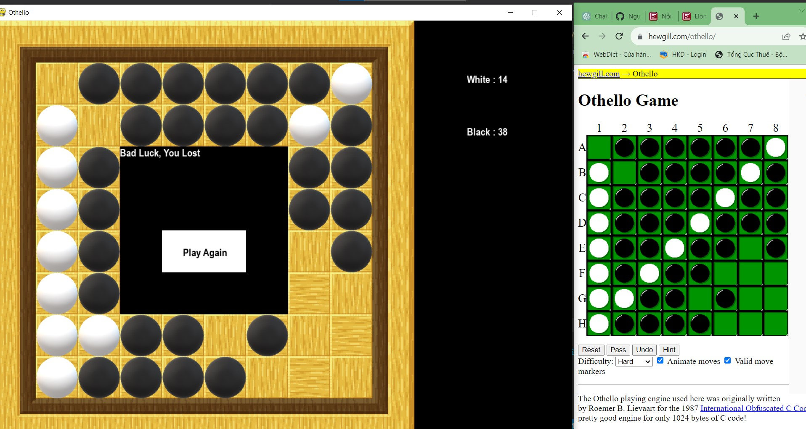

# Phần này sẽ để báo cáo kết quả thử nghiệm của các từng thuật toán
## Format 
- Nêu hàm heuristic sử dụng 
- Kết quả thu được, nêu rõ tham số sử dụng (depth, hàm/engine đem ra so sánh, số ván chơi)
- Giải thích kết quả + show code/hình ảnh minh họa  

**1. Minimax Algorithm**
- Heuristic 1: Coin Party

- Heuristic 2: Local Maximization (basically add weight for each cell)

